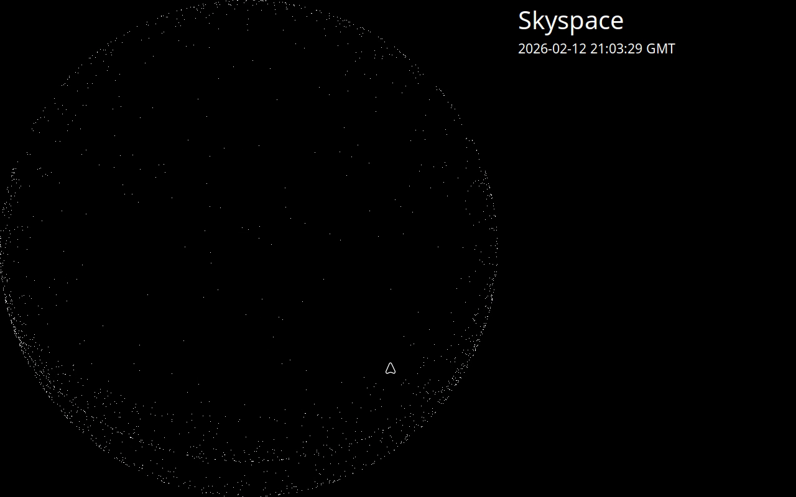

> [!IMPORTANT]
> At the moment this is this is a proof of concept held together by string and sticky tape.

Currently it generates a series of images of the sky above Greenwich, showing satellites and other
man made objects passing overhead.

Each satellite is currently just a single pixel.  So you probably need to zoom in or click to enlarge, before you can see them tracking across the sky.

 

But there is just so much left to do.  For example (no particular order):

* Do a gradient fill to make the projection look domed.
* Label or colour objects by type, size, visibility or altitude. 
* Display details of the selected satellite.
* Restructure the code.
* Fetch SATCAT data and use Radar Cross Section (RCS) to distinguish small and large objects and where it was launched from. https://celestrak.org/satcat/records.php?GROUP=visual&FORMAT=CSV&ONORBIT=true & https://celestrak.org/satcat/satcat-format.php
* Include the sun, moon and stars (perhaps).

## Licenses

This repository includes code authored by David Vallado. The copyright of all code under [main/celestrak](main/celestrak) remains his and has a separate license.  See [main/celestrak/README.md](main/celestrak/README.md) for details on the license.

The license on everything else is Apache-2.0.

## Setting up

Currently set up is only outlined for Linux.  Much of the software should work in other environments, but you will need to determine the set up for yourself (include how to display the images).

The assumption is that you have a machine with a GPU that can be accessed using OpenCL.

### Linux

I will assume you know how to install packages on your version of Linux.  Some might be available through a graphical "Software Manager", but for others you will probably need to use a command line package manager (for example "apt" on Debian, Ubuntu or Mint).

#### Install

You probably already have:

* bash
* make

You will also need:

* python3
* python-is-python3 (to set up python3 to run when you use python at the command line)
* python3-pip
* python3-venv
* python3-tk
* mesa-opencl-icd (other CL platforms are available)
* clinfo (to help find out what GPU devices you have)

The following command will then download and install all the python packages required into a sub-directory called venv.

    make dependencies

#### Configure

Next you need to determine:

* What GPU devices you have
* Which GPU device you wish to use
* What environment variables you need to set to enable it

Run the following command:

    clinfo --list

This will probably show at least 2 platforms: Mesa Clover and Mesa Rusticl.  If you have an NVIDIA GPU with the drivers installed then you will also see that. If you want to use platform 0, device 0, then create a file called `.device.mk` with following contents:

    DEVICE_ENV=PYOPENCL_CTX="0:0"

The first digit is the platform id, the second is the device id.

The following command compiles and runs a simple OpenCL kernel. During this process it also output the name of the selected platform and device:

    make test-setup

If the test works, then skip the rest of this section.  However, if you want to try using the Rusticl platform then try this command enabling all Rusticl drivers to see which ones get listed.

    RUSTICL_ENABLE=iris,nouveau,panfrost,radeonsi,r600 RUSTICL_FEATURES=fp64 clinfo --list 

[Rusticl environment variables](https://docs.mesa3d.org/envvars.html#rusticl-environment-variables). _Note: llvmpipe does not provide any hardware acceleration._

Select the device you have (say radeonsi), then repeat with just that enabled:

    RUSTICL_ENABLE=radeonsi RUSTICL_FEATURES=fp64 clinfo --list 

If this shows radeonsi as platform 0, device 0, then create the `.device.mk` with following contents:

    DEVICE_ENV=RUSTICL_ENABLE=radeonsi RUSTICL_FEATURES=fp64 PYOPENCL_CTX="0:0"

Try the `make test-setup` command again.

With radeonsi you may get the message `ac_compute_device_uuid's output is based on invalid pci bus info`.  This is an apparently harmless warning.  "ac\_compute\_device\_uuid" is a function that generates a unique id for your GPU.  It outputs this message when it cannot access details of your hardware, but continues without it.  Some sources say that adding your username to the `video` and `render` groups and restarting can avoid the warning - but it didn't work for me.

#### Testing

Now you should be able to run the unit tests with this command:

    make test

There will probably be some warnings that can be ignored.  As this is very much at the proof-of-concept stage - not everything has a test yet.

#### Running

Fetch Celestrak TLE data with this command:

    make tle-fetch

Start the generation and display of skyscape images:

    make run

Click on or near a satellite to see its NORAD id.  Use 'q' or 'Esc' to terminate the program.

